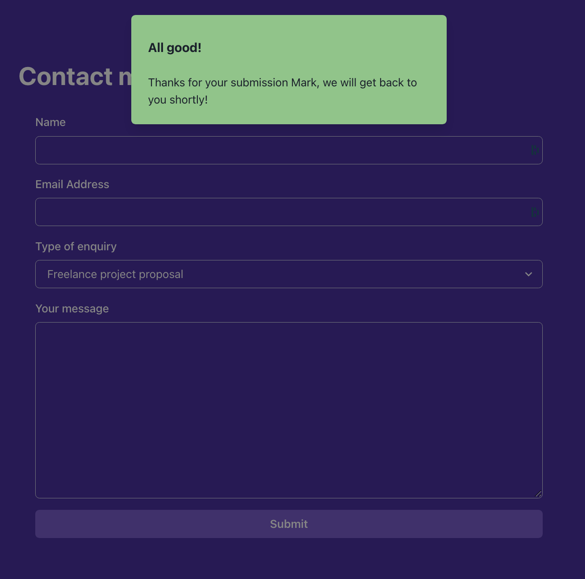

### **Step 4**

Open the `ContactMeSection.js` component. Implement the remaining requirements of the form according to the below specifications.

The form contains 4 input fields: name, email address, type of enquiry and message.

The whole UI of the form is defined for you. You need to implement some missing business logic.

a) **Add the proper configuration to the `useFormik` hook, passing an object with 3 properties**: `initialValues`, `onSubmit` and `validationSchema`. 

The `initialValues` object should have the following fields:
- `firstName`: The name of the user
- `email`: The email of the user
- `type`: 'hireMe' | 'openSource' | 'other'
- `comment`: A message from the user

The `onSubmit` function should perform an API call by using the `submit` helper from `useSubmit` hook. 
Inspect the `useSubmit` custom hook to see the arguments the `submit` function expects.

The `validationSchema` should be a Yup schema that validates the form fields. The validation rules are as follows:
- `firstName`: required field. Otherwise, the error message should be "Required".
- `email`: required field and a valid email. If empty, the error message should be "Required". If not a valid email, the error message should be "Invalid email address".
- `type`: Optional field
- `comment`: required field and with a minimum of 25 characters. If empty, the error message should be "Required". If less than 25 characters, the error message should be "Must be at least 25 characters".

b) **Make the `Input` components from Chakra UI controlled components**.

`useFormik` hook returns an object with a function called `getFieldProps` that when called, returns an object with the necessary props to make the input controlled.

c) **Show the error messages for each field when the field is touched and the validation fails**. 

Each field is grouped in a `FormControl` component. The `FormControl` component takes a `isInvalid` prop that you can use to show the error message.

The `isInvalid` prop should be `true` when the field is touched and the validation fails.

The `FormErrorMessage` component from Chakra UI should display the corresponding error message if the `isInvalid` prop from the parent `FormControl` component is true.

Below is an example of how the UI should look like when the validation fails for the `firstName` field:

d) **Connect the `form` onSubmit prop with Formik's `handleSubmit` function.**

Make sure the default HTML form behaviour is prevented when a submission occurs.

e) **Show an alert when the form is submitted successfully**.

You need to listen to changes in the `response` object from the `useSubmit` hook. Also, when the form is submitted, a loading indicator should be shown in the Submit button. You can use the `isLoading` property from the `useSubmit` hook.

The `useSubmit` hook is implemented in a way that 50% of the times it will return a successful response and 50% of the times it will return an error response.

The `response` object from the API has 2 properties:
- `type`: 'success' | 'error'
- `message`: Extra contextual information about the response

You can use the provided `useAlertContext` hook to show the alert. The hook returns a function named `onOpen` that you can call to display it.

Check the `alertContext.js` file to see the arguments the `onOpen` function expects.

If the response is successful, the alert should display in its content the first name of the user, according to the value typed in the form 1st field, so make sure you are passing the right arguments to the `submit` function returned from the `useSubmit` hook.

In addition, the form has to be reset if the response is successful. For that use the `resetForm` function from the object returned from the `useFormik` hook.

This is how the UI should look for both cases:

### **Step 5 (bonus)**

Implement a header show/hide animation depending on the scroll direction.
The header should slide up with some animation and be hidden when scrolling down the page.
When scrolling up, the header should slide down and be visible.

For that, the outermost Box component has some transition properties already defined. Your logic should change the `transform` property of the underlying `Box` DOM element depending on the scroll direction.

When scrolling up, the `transform` style property from the `Box` DOM element should be `translateY(0)`.
When scrolling down, the `transform` style property from the `Box` DOM element should be `translateY(-200px)`.

Here are some of the elements you may need for the implementation:
- The `useEffect` hook
- The `useRef` hook
- Setting up listeners for the scroll event `window.addEventListener('scroll', handleScroll)`
- Removing listeners for the scroll event: `window.removeEventListener('scroll', handleScroll)`
- Keeping track of the previous scroll position in a variable

